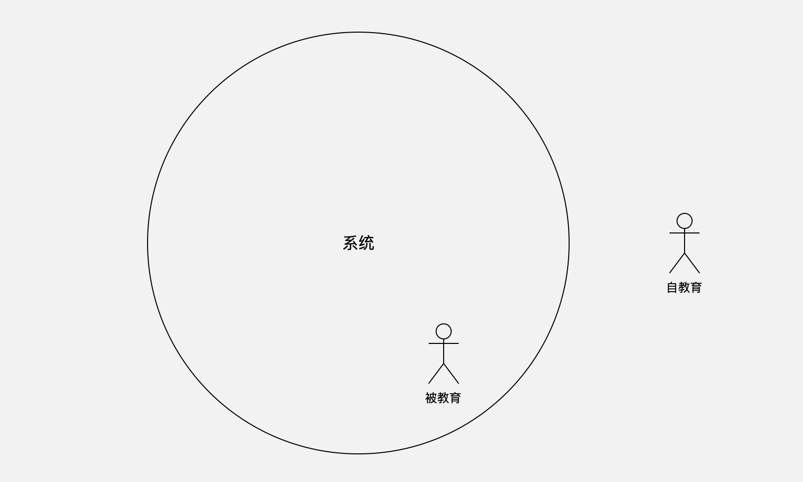
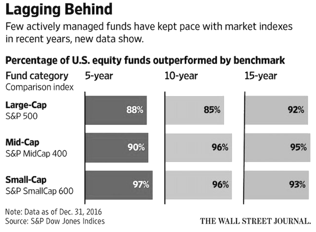

# Fixed Investment - Self-Cultivation of Tycoons

*—— Let time enrich you...*

**李笑来**

July, 2019

*The "cost of emptying"for ordinary people who miss the book is infinite...*

https://b.watch

---

## 9. 定投策略神奇力量背后的深刻机理

让我们从一对看起来是对立的概念说起：

> **Active** and **Passive**

In general, active and passive are considered to be antonyms. “Active” is generally understood to be positive, while relatively “passive” is often understood as negative.

### 9.6 How powerful is the passive force of following the trend?

先从反面举一个例子。我们平时所说的**教育**，就是能够展示被动的负面力量的绝佳例子。

Generations of people who are complaining about the failure of education - they are not only complaining about their failure in education, but also complaining about the failure of education in society as a whole. Not only in China, but also in the world, they are rethinking their so-called education again and again. — But if you are willing to change the angle, you will find the opposite explanation:

> In fact, in any era, in any country, education has always been exceptionally successful!

为什么会有这样的结论？因为我们换了个角度去定义教育：

> **The so-called education, in essence, is what the system in which an individual is located wants to make him or her look like...**

Everyone is in a series of interlocking systems, our circle, our culture, our society, our country, our world... These are “already mature systems”. Don't be fooled into thinking that they are only objectively existing. In fact, way more beyond, these systems are actually living, and even having souls. They have the power and means of gods.

You see, in any system, there are people with vested interests and non-vested interests; the former is very few, while the latter is the vast majority. As a result, the goal of education is clear, and the people with vested interests will use it to make it more beneficial to themselves - without further explanation, you know what they will do! Non-vested interests will soon find that the unevenness of power is in the process of confrontation, so the overwhelming majority will turn to serve the vested interests; the few non-vested interests who still resist will eventually be eliminated; If the resistance of non-vested interests is successful, then they will instantly become vested interests and open the next "new" system that is also serving vested interests... This is an indiscriminate fact, so it is completely unnecessary to complain, because it is the same everywhere on the planet. Isn't that the case?

所以，所谓的教育，不过是这样定义的：

> **教育就是你所身处的那个系统想让你变成什么样子……**

If education is so defined, and if the status quo is indeed the case, then the conclusion is obvious: all education in history has been quite successful, and can even be called exceptional success... and it has always been more and more successful. From this point of view, the failure of education that people complain about is, in essence, nothing more than the discomfort of the people with non-vested interests in the system.

Do ordinary people have a way out? Still there is.

如果教育是那样定义的，那么**自学**应该如何定义呢？

> **如果，教育就是这个系统想让你变成什么样子，那么，与之相对地，自学，就是你自己想要变成什么样子。**

所以，更准确的措辞可能是两个相对的词汇：

> - 被教育
> - Self educated

The vast majority of people feel extremely uncomfortable in the process of being educated (ie, the process of assimilation by the system) – this is natural. However, the next choice is the strongest to reflect the struggling: the vast majority of people give up being educated, and **only a very small number of people choose self-education.** Self-educated people are self teaching not only from time to time, but also for the whole life. What is striking is that after carefully observing history, you will find that **people who change the world are self-educated without exception.**

On the other hand, whether they are educated or abandoned being educated, they are ultimately assimilated by the system - passive forces have exerted a very powerful influence on them, so powerful that they are helpless and ultimately thought it was the power from the ghosts.

There is a TV series called "Year after Year", produced in 1999. I suggest you take the time to watch. The story begins in 1978 and each episode speaks a whole year, for a total of 21 episodes. A role in the story is the cinema projection staff, so each episode mentions a movie of the specific year. In addition, each episode has a song of the year. More importantly, each episode reminds you of one of the most important events of the year... The story is not particularly good, but it can make you I really feel how small each individual is in a system and how powerful the factors you can only passively face.

The strength of the negative forces that we can only passively face, at the same time, is equal to their positive power. Let's take a look at an example of the passive positive forces associated with us that play a huge positive role.

在基金管理领域，基金被分为两种，**主动型基金**和**被动型基金**。

上图展示的是，过去若干年来，全球范围内主动型基金和被动型基金的资金流入情况。为什么资本越来越青睐被动型基金呢？为什么主动型基金越来越被嫌弃呢？就是因为资本越来越清楚地认识到被动的力量。

主动型基金，需要一票管理人，他们负责分析市场，而后挑出一个能够跑赢大市的投资组合。基于对这些管理者的期待，投资者需要支付相当高昂的管理费和分成，并且还要承担这些管理者的频繁买卖之交易费用。与之相反，被动型基金不标榜自己的分析能力，不去做主动的频繁操作，只是被动地跟随某一个代表性的指数（比如 S&P 500）……

For many years, questions about fund managers have never been rare. Some people even joke that you throw stocks into a house, put a monkey in, and after a while, pick out the stocks of the monkeys that have been urinated to form a portfolio, and the final result can also outweigh those active funds. Fund manager...

果真如此吗？抑或它真的只不过是个玩笑而已？你要了解的是，现代化的证券交易市场发展壮大的历史并不长，真正算得上现代化的交易市场直到上个世纪七十年代才出现，人们对交易市场中的各种现象，迄今为止只有四五十年左右的数据可供有效研究。

根据 [Wall Street Journal ](https://www.wsj.com/articles/indexes-beat-stock-pickers-even-over-15-years-1492039859)（2017 年 4 月 13 日）的统计，截至 2016 年 12 月 31 日，按 15 年的表现来看，总计有 95.4% 的中型基金落后于 S&P MidCap 400，93.2% 的小型基金落后于 S&P SmallCap 600，92.2% 的大型基金落后于 S&P 500……

主动基金的拥趸们有一个貌似合理的反对意见。他们认为，随着越来越多的钱流入被动型基金，最终会使策略变成“随大流”而已，而这会使得主动基金管理相对更有优势。然而，长期投资者其实都明白市场的短期突变或者一个新的潮流会让主动基金管理者获得短暂的优势，不过，从基于 15 年的统计结果来看，长期投资者们可以将其忽略不计了……

The most interesting part is the conclusion:

> - **The longer the investment cycle**, the greater the passive advantage;
> - 投资**额度越大**，被动的优势越大……

我个人过往的经验更是向我自己印证了这一点。

In 2013, I began to manage an early fund that was particularly small and invested in Bitcoin-related projects. By 2018, that is, a four-year management period, plus a one-year liquidation period, after a total of five years, the market value of the fund has become about 68 times the starting amount... Although it looks very amazing, it actually makes people quite discouraged - because this score did not outperform Bitcoin's gains. In other words, if all the funds were used to buy Bitcoin at the time, and I did nothing in the next 5 years, then it would be 58 times. You can see that the final result will not be much worse than the current one. Of course,I make profit by doing a fund, and after 30% of the starting profit, the return of the investor has become about 48 times, slightly lower than the growth of Bitcoin itself.

What is even more discouraging is another factor. In the past five years, it is breath-taking and heart-stirting for managing this fund – a few times almost plummeted to the bottom, and then made a comeback by luck... In the process, it is normal, in fact, if this fund is really lost; especially, the blockchain world is a place where the amplitude of fluctuations is many times larger than the stock market.

Not losing is a happy accident. It’s actually a surprise in the accident. Therefore, when the bit fund was finally liquidated, I felt that I could only be a passive fund in the next step. There was no other choice at all. After more than a year of thinking, I finally designed the [BOX](https://b.watch), an open source blockchain ETF fund product. The current booklet is actually a reflection of the process of creating my ideal passive fund model.

Let us focus on the key point of this section first.

Let us think: the same conclusion, when is mapped to the individual, cannot be applied directly every time:

> - **For those more ambitions, the more passive forces are needed;**
> - **For those with more energy, the more passive power is needed...**

被动的力量不仅很大很大，并且**它总是越长期越难以超越**。

Once passive forces are triggered, they are unbeatably powerful. However, **being active will trigger passive positive forces, and passives will trigger passive negative forces.** Therefore, it is said that only actively passive is the optimal strategy.

In addition, with regard to following the flow or trend, you may have new insights:

> - 看着短期的结果随大流肯定是错的；
> - Aiming at long-term results is perhaps the only right choice when following the big flow...

You see, even if everyone thinks that they understand a word, "follow the big flow", after a little serious thinking, they will get different, even may form diametrically opposite conclusions.
